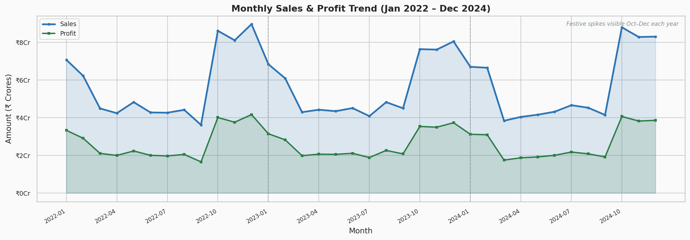
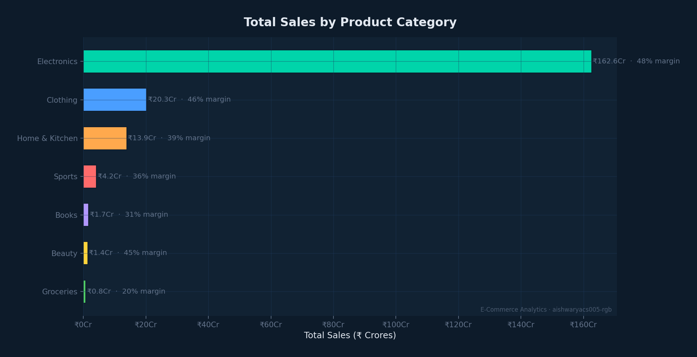
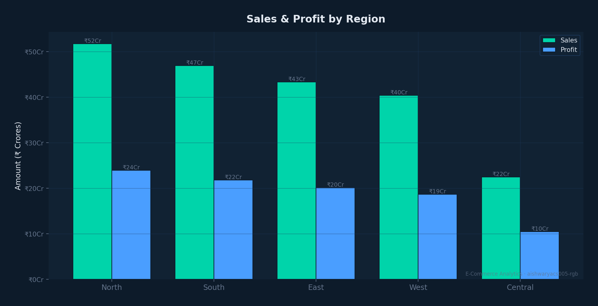
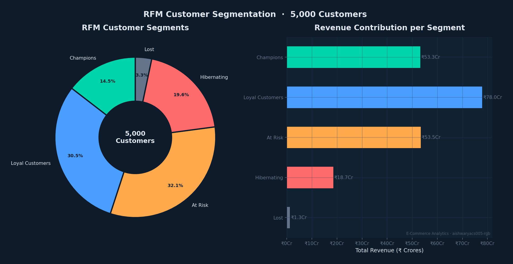
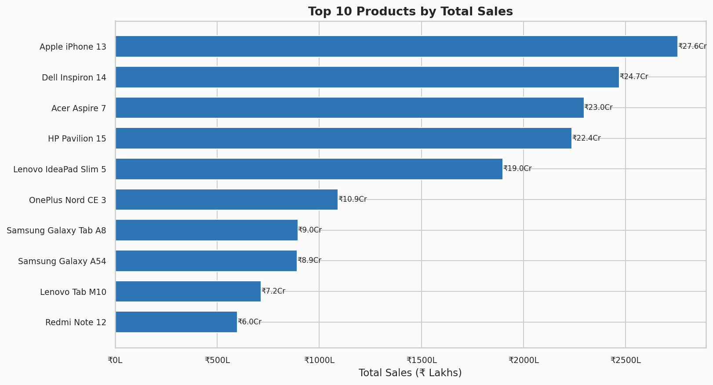
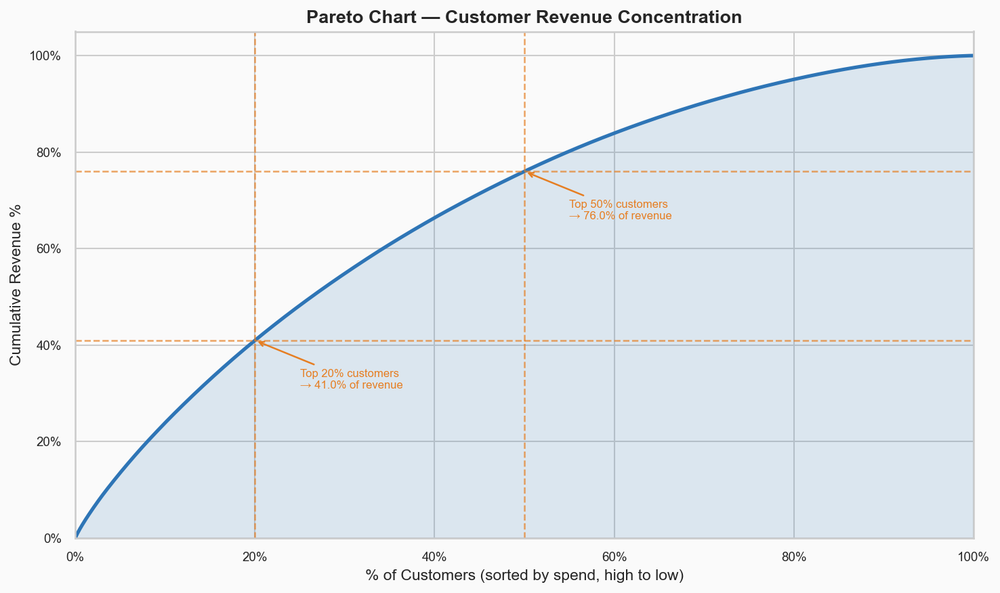

# E-Commerce Sales & Customer Analytics

**End-to-end Data Analytics portfolio project** analyzing 3 years of e-commerce sales data (50,000 orders, 5,000 customers, ₹204 Crores revenue) using Excel, Python, SQL, Power BI, and AWS S3.

[](https://python.org)
[](https://sqlite.org)
[](powerbi/)
[](aws/)
[](excel/)

---

## Dashboard Preview

| Monthly Sales Trend | Category Performance |
|---|---|
|  |  |

| Regional Sales | RFM Segmentation |
|---|---|
|  |  |

| Top 10 Products | Customer Tier Revenue |
|---|---|
|  |  |

---

## Business Problem

An Indian e-commerce company wants to understand:
- Why revenue spikes in certain months and drops in others
- Which product categories and regions drive the most profit
- Which customers are at risk of churning
- Where the business is losing revenue to cancellations and returns
- How to prioritize marketing spend for maximum ROI

---

## Project Objectives

| # | Objective |
|---|-----------|
| 1 | Analyze revenue, profit, and margin trends across 3 years |
| 2 | Identify top and bottom-performing products and categories |
| 3 | Understand regional sales distribution across 5 Indian regions |
| 4 | Segment customers using RFM analysis |
| 5 | Quantify revenue lost to order cancellations and returns |
| 6 | Build an interactive Power BI dashboard for business reporting |
| 7 | Generate actionable business recommendations from data |

---

## Dataset

| Table | Rows | Description |
|-------|------|-------------|
| customers | 5,000 | Customer demographics, location, type |
| products | 61 | Product catalogue with cost and selling price |
| orders | 50,000 | Order header: date, customer, payment, status |
| order_details | 83,603 | Line items: quantity, sales, cost, profit |
| regions | 26 | Geographic lookup: Region → State → City |

**Date Range:** January 2022 – December 2024  
**Geography:** 5 regions, 18 states, 26 cities across India  
**Categories:** Electronics, Clothing, Home & Kitchen, Sports, Books, Beauty, Groceries

> Dataset was synthetically generated using Python with realistic business patterns (seasonal spikes, category-based pricing, discount logic, RFM-realistic purchase frequencies).

---

## Tools & Technologies

| Tool | Purpose |
|------|---------|
| **Python** (Pandas, NumPy) | Data generation, cleaning, transformation, EDA |
| **Matplotlib / Seaborn** | 21 charts and visualizations |
| **SQL (SQLite)** | Relational database + 25 business analysis queries |
| **Excel (xlsxwriter)** | 9-sheet workbook with pivot tables and charts |
| **Power BI** | 4-page interactive dashboard with 19 DAX measures |
| **AWS S3** | Cloud storage for raw and cleaned data |
| **Git / GitHub** | Version control and project hosting |

---

## Data Pipeline

```
Raw Dataset (CSV)
      ↓
Excel Analysis (9 sheets, 5 charts, 7 KPIs)
      ↓
AWS S3 (raw/ cleaned/ processed/ folders)
      ↓
Python — Data Cleaning (36-column cleaned dataset)
      ↓
Python — EDA (21 visualizations)
      ↓
SQL Database (5 tables, 7 indexes, 25 queries)
      ↓
Customer Analytics (RFM segmentation, Pareto analysis)
      ↓
Power BI (4-page interactive dashboard)
      ↓
Business Insights (9 insights + 8 recommendations)
```

---

## Phase Summary

### Phase 1 — Data Understanding
- Inspected all 5 tables: shapes, dtypes, nulls, duplicates
- Documented every column in a Data Dictionary
- Confirmed: 0 null values, 0 duplicates, correct date range

### Phase 2 — Excel Analysis
Built a professional 9-sheet Excel workbook (`excel/ecommerce_analysis.xlsx`):
- KPI Summary sheet with 7 business metrics
- Data quality check (COUNTBLANK formulas)
- Category, Monthly, Regional, Product, Payment, and Customer Segment analysis
- 8 charts embedded in worksheets

### Phase 3 — AWS S3
- S3 bucket with `raw/`, `cleaned/`, `processed/` folder structure
- Python boto3 upload script with `.env` credential management
- Security: all public access blocked, SSE-S3 encryption, IAM user with least-privilege

### Phase 4 — Python Data Cleaning
Cleaned dataset: **83,603 rows × 36 columns** (`data/cleaned/ecommerce_cleaned.csv`)

Cleaning steps performed:
- Stripped whitespace, standardized text casing
- Parsed Order_Date to datetime64
- Validated numeric ranges (Quantity, Discount, Sales, Cost, Profit, Age)
- Removed duplicates (none found — verified clean source)
- Fixed Payment_Mode casing (UPI, EMI, Cash on Delivery)

Calculated columns added:

| Column | Formula |
|--------|---------|
| Profit_Margin_Pct | (Profit / Sales) × 100 |
| Discount_Amount | Unit_Price × Quantity × Discount |
| Age_Group | Bins: 18-25, 26-35, 36-45, 46-55, 56+ |
| Season | Festive / New Year / Summer / Monsoon |
| Order_YearMonth | YYYY-MM period format |
| Is_High_Value | True if Sales ≥ top 5% threshold |

### Phase 5 — Exploratory Data Analysis
21 charts saved to `screenshots/`:

| Chart | Key Finding |
|-------|------------|
| Monthly Sales Trend | Clear festive spikes Oct–Dec each year |
| Year-over-Year | Revenue stable across 2022–2024 (~₹68Cr/year) |
| Category Sales | Electronics = 79.4% of revenue |
| Profit Margin % | Electronics highest (47.7%), Groceries lowest (20.4%) |
| Top 10 Products | All Electronics (Apple iPhone 13 leads at ₹27.5Cr) |
| Regional Sales | North leads (25.3%), Central lags (11.0%) |
| Payment Mode | UPI = 30%, Credit Card = 19.9% |
| RFM Scatter | Clear segment clusters visible |

### Phase 6 — SQL Analysis
Database: `sql/ecommerce.db` (SQLite, 7.6 MB)

25 queries covering:
- Revenue, profit, orders, customers, products KPIs
- Monthly and quarterly trends with window functions (LAG)
- Top/Bottom product and category performance
- Regional and state-level analysis
- Payment method breakdown
- Customer frequency, retention, CLV
- RFM-based spending segments
- Pareto revenue concentration

Key SQL techniques used: `GROUP BY`, `HAVING`, `JOIN`, `CASE`, `CTE`, `Subqueries`, `LAG()`, `NTILE()`, `JULIANDAY()`

### Phase 7 — Customer Analytics & RFM

**RFM Segmentation Results:**

| Segment | Customers | Revenue Share | Avg Spend |
|---------|-----------|---------------|-----------|
| Champions | 726 | 26.0% | ₹7.3L |
| Loyal Customers | 1,523 | 38.1% | ₹5.1L |
| At Risk | 1,606 | 26.1% | ₹3.3L |
| Hibernating | 981 | 9.1% | ₹1.9L |
| Lost | 164 | 0.7% | ₹82K |

Key findings:
- Average 10 orders per customer across 3 years
- Top 20% of customers contribute ~41% of revenue (Pareto effect)
- Female customers have slightly higher revenue per customer (₹413K vs ₹406K)
- Age 46–55 is the highest-value age group by revenue per customer

### Phase 8 — Power BI Dashboard

4-page interactive dashboard (`powerbi/`):

| Page | Contents |
|------|---------|
| Executive Overview | 6 KPI cards, monthly trend, category bar, region column, status donut |
| Product Analytics | Top/Bottom 10 table, sub-category matrix, scatter chart |
| Customer Analytics | RFM donut, new vs returning, age group, top 15 customers |
| Regional Analytics | State map, region table, category×region heatmap |

19 DAX measures including time intelligence (SAMEPERIODLASTYEAR, TOTALMTD, TOTALQTD)

### Phase 9 — Business Insights

9 data-driven insights with Observation → Insight → Recommendation structure:

1. **Electronics Concentration Risk** — 79.4% revenue from one category
2. **Groceries Margin Warning** — 20.4% margin barely covers operating costs
3. **Central Region Underperformance** — only 11% of revenue despite large geography
4. **Festive Season Dependency** — 36.3% of annual revenue in Oct–Dec
5. **UPI Payment Dominance** — 30% of orders; EMI has high-value potential
6. **₹31 Crore Lost Revenue** — cancellations (₹18.8Cr) + returns (₹12.3Cr)
7. **Returning Customer Volume Advantage** — same AOV but 51% more orders
8. **1,606 At Risk Customers** — higher win-back ROI than new acquisition
9. **Volume Traps** — 10 products with high sales but margin below 35%

---

## Key Findings

- **Total Revenue:** ₹204.9 Crores over 3 years
- **Profit Margin:** 46.4% overall
- **Average Order Value:** ₹40,973
- **Top Category:** Electronics (79.4% revenue, 47.7% margin)
- **Top Region:** North India (₹51.7 Crores)
- **Top Payment:** UPI (30% of orders)
- **Festive Season:** 36.3% of annual revenue in Q4
- **At Risk Customers:** 1,606 (require immediate retention campaign)
- **Revenue at Risk:** ₹31.1 Crores from cancellations + returns

---

## Business Recommendations

| Priority | Action | Expected Impact |
|----------|--------|-----------------|
| 1 | Win-Back campaign for 1,606 At Risk customers | +₹5–8Cr |
| 2 | Reduce Groceries SKUs to high-margin items only | +1–2% overall margin |
| 3 | Build mid-year sale event (July–August) | Reduce festive dependency |
| 4 | No-cost EMI for Electronics orders >₹20K | +15–20% Electronics AOV |
| 5 | Reduce cancellation rate from 9% to 5% | Recover ₹8–10Cr |
| 6 | Expand logistics in Central India | Unlock ₹20–30Cr new market |
| 7 | Grow Clothing & Beauty — both have 45%+ margins | Revenue diversification |
| 8 | Loyalty programme for 726 Champions | Protect ₹55Cr revenue base |

---

## Project Structure

```
ecommerce-sales-customer-analytics/
│
├── data/
│   ├── raw/                         # Original generated CSVs (5 files)
│   ├── cleaned/                     # Cleaned + RFM-segmented data
│   │   ├── ecommerce_cleaned.csv    # 83,603 rows × 36 columns
│   │   ├── rfm_segments.csv         # 5,000 customers with RFM scores
│   │   └── cleaning_report.txt      # Audit trail of all cleaning steps
│   ├── data_dictionary.md           # Every column documented
│   └── business_insights_report.md  # 9 insights + 8 recommendations
│
├── python/
│   ├── generate_dataset.py          # Synthetic dataset generator
│   ├── phase1_data_understanding.py # Data inspection + profiling
│   ├── prepare_excel_data.py        # Creates flat CSV for Excel
│   ├── phase2_excel_analysis.py     # Builds Excel workbook programmatically
│   ├── phase4_data_cleaning.py      # Full cleaning pipeline
│   ├── phase5_eda.py                # 15 EDA charts
│   ├── phase7_customer_analytics.py # RFM + customer segmentation + 6 charts
│   ├── phase8_powerbi_export.py     # Exports fact/dim tables for Power BI
│   └── phase9_business_insights.py  # Generates insights report
│
├── sql/
│   ├── schema.sql                   # CREATE TABLE statements + indexes
│   ├── load_database.py             # Loads CSVs into SQLite
│   ├── analysis_queries.sql         # 25 business analysis queries
│   ├── customer_analysis.sql        # 10 customer analytics queries
│   ├── run_analysis.py              # Executes & prints all 25 queries
│   └── ecommerce.db                 # SQLite database (7.6 MB)
│
├── excel/
│   └── ecommerce_analysis.xlsx      # 9-sheet workbook with charts
│
├── powerbi/
│   ├── fact_orders.csv              # Main fact table for Power BI
│   ├── dim_customers.csv            # Customer dimension + RFM segment
│   ├── dim_products.csv             # Product dimension
│   ├── monthly_summary.csv          # Pre-aggregated monthly data
│   └── powerbi_guide.md             # Step-by-step dashboard build guide
│
├── aws/
│   ├── aws_setup.md                 # S3 bucket creation + security guide
│   └── s3_upload.py                 # boto3 upload script
│
├── screenshots/                     # 21 chart PNGs (EDA + Customer)
│
├── .env.example                     # AWS credential template
├── .gitignore                       # Excludes .env, __pycache__, etc.
├── requirements.txt                 # All Python dependencies pinned
└── README.md                        # This file
```

---

## How to Reproduce

### 1. Clone the repository
```bash
git clone https://github.com/aishwaryacs005-rgb/ecommerce-sales-customer-analytics.git
cd ecommerce-sales-customer-analytics
```

### 2. Install dependencies
```bash
pip install -r requirements.txt
```

### 3. Generate the dataset
```bash
python python/generate_dataset.py
```

### 4. Run all phases in order
```bash
python python/phase1_data_understanding.py
python python/phase2_excel_analysis.py
python python/phase4_data_cleaning.py
python python/phase5_eda.py
python sql/load_database.py
python sql/run_analysis.py
python python/phase7_customer_analytics.py
python python/phase8_powerbi_export.py
python python/phase9_business_insights.py
```

### 5. Open Power BI Dashboard
- Open Power BI Desktop
- Import files from `powerbi/` folder
- Follow `powerbi/powerbi_guide.md` step by step

### 6. AWS S3 (optional)
- Copy `.env.example` to `.env` and fill in your credentials
- Run: `python aws/s3_upload.py`

---

## Skills Demonstrated

**Data Analysis**
- Exploratory Data Analysis (EDA)
- Statistical summarization and profiling
- Outlier detection (IQR method)
- Cohort analysis and customer retention

**Python**
- Pandas (merge, groupby, pivot, resample, qcut)
- NumPy (statistical operations)
- Matplotlib & Seaborn (15+ chart types)
- xlsxwriter (programmatic Excel workbook generation)
- boto3 (AWS S3 SDK)

**SQL**
- DDL (CREATE TABLE, indexes)
- DML and aggregation (SELECT, GROUP BY, HAVING, ORDER BY)
- Joins (INNER JOIN across 5 tables)
- Subqueries and CTEs
- Window functions (LAG, NTILE, ROW_NUMBER)
- Date functions (STRFTIME, JULIANDAY)

**Business Intelligence**
- Star schema data modelling (fact + dimension tables)
- DAX measures (19 measures including time intelligence)
- KPI card design
- Drill-through and cross-filter interactions
- RFM customer segmentation

**Cloud & DevOps**
- AWS S3 bucket creation and organization
- IAM user and access key management
- boto3 programmatic uploads
- Git version control
- .gitignore and secrets management

**Business Acumen**
- Revenue and profitability analysis
- Customer lifetime value approximation
- Pareto analysis (80/20 rule)
- Seasonal trend identification
- Actionable recommendation generation

---

## Screenshots

> *(Add your Power BI dashboard screenshots here after building the dashboard)*

| Page | Preview |
|------|---------|
| Executive Overview | `screenshots/powerbi_page1.png` |
| Product Analytics | `screenshots/powerbi_page2.png` |
| Customer Analytics | `screenshots/powerbi_page3.png` |
| Regional Analytics | `screenshots/powerbi_page4.png` |

---

## Author

**Aishwarya C S**  
Aspiring Data Analyst | Python · SQL · Power BI · AWS

- LinkedIn: linkedin.com/in/aishwaryacs005
- GitHub: github.com/aishwaryacs005-rgb
- Email: [your-email]

---

*This project was built as a complete end-to-end Data Analytics portfolio piece demonstrating the full analyst workflow: data ingestion → cleaning → exploration → SQL analysis → customer segmentation → BI dashboard → business insights.*
